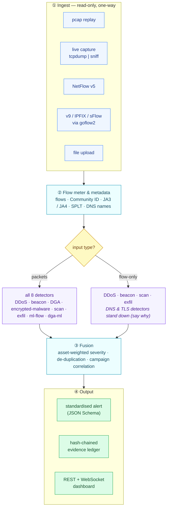
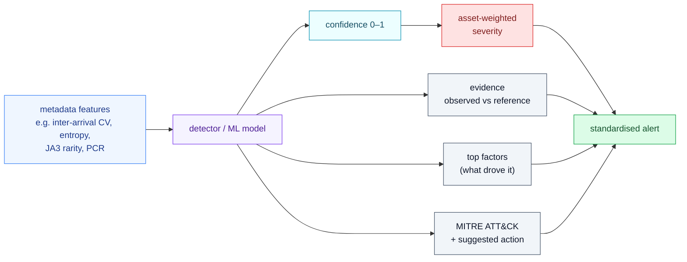

# Enclave Threat Console

**AI/ML detection of cyber threats in one-way (unidirectional) IP traffic.**

Critical-infrastructure links are copied one way into a monitoring enclave through a passive TAP or a
hardware data diode — traffic goes *in*, nothing can come *back*. This project turns that one-way
stream into real-time, scored, **explainable** alerts for six threat classes, using only passively
observed metadata. It never decrypts, never probes, and never blocks.

---

## The problem

A monitoring box behind a diode can *see* everything on the link but has **no path back** into the
production network. That kills an entire class of attacks (a hacked analytics box can't pivot inward),
but it means the detection logic must work **purely from what it passively observes** — packets, flow
records, and metadata — with no probing, no handshakes, no decryption, and no way to push a block.

## Our solution

A streaming pipeline that ingests the one-way feed and detects, classifies and scores threats in near
real time. Detection is a **hybrid**: fast, always-on statistical detectors form the floor, and **two
supervised ML models** (trained on real CIC-IDS2017 traffic) add a dataset-trained second opinion.
Every alert explains *why* it fired — feature evidence, weighted factors, and a MITRE ATT&CK mapping —
and lands in a tamper-evident, hash-chained ledger.

---

## How it works

```mermaid
flowchart LR
    GW["Gateway / peering link<br/>production traffic"]:::prod
    DIODE{{"TAP / Data diode<br/>one-way copy"}}:::diode

    subgraph ENC["🛡️ Monitoring enclave — no route back to production"]
        direction LR
        ING["Ingest<br/><i>read-only</i>"]:::stage
        MET["Flow meter +<br/>DNS / TLS metadata"]:::stage
        DET["Detect<br/><b>6 statistical + 2 ML</b>"]:::stage
        FUS["Fuse<br/>score · dedup · correlate"]:::stage
        OUT["Alerts<br/>dashboard · ledger · SIEM"]:::out
        ING --> MET --> DET --> FUS --> OUT
    end

    GW -->|mirror| DIODE
    DIODE ==>|one direction only| ING

    classDef prod fill:#e0e7ff,stroke:#4f46e5,color:#312e81
    classDef diode fill:#fde68a,stroke:#d97706,color:#7c2d12
    classDef stage fill:#f1f5f9,stroke:#475569,color:#0f172a
    classDef out fill:#dcfce7,stroke:#16a34a,color:#14532d
```



**In plain words, from left to right:**

1. The switch/router **mirrors** production traffic into a TAP or data diode.
2. The diode passes that copy **one way only** into the enclave — there is physically no route back.
3. **Ingest** reads the stream read-only and records a SHA-256 of every capture (chain of custody).
4. The **flow meter** turns packets into flows (5-tuple, Community ID) and extracts safe metadata —
   JA3/JA4 TLS fingerprints, packet size/timing sequences (SPLT), and cleartext DNS names. No payload
   is decrypted.
5. **Detectors** score each flow/event; a suspicious one becomes a `Detection` with evidence.
6. **Fusion** weights it by asset criticality, removes duplicates, and links related stages into one
   campaign.
7. The result is a **standardised alert** shown live on the dashboard and appended to the ledger.

---

## Inside the pipeline



**What each stage does**

| Stage | What happens |
| --- | --- |
| **① Ingest** | Accepts the one-way feed from any source — recorded pcap, live interface, NetFlow, IPFIX/sFlow (via goflow2), or an uploaded file. Strictly read-only; a process-level guard blocks any outbound connection. |
| **② Flow meter & metadata** | Aggregates packets into flows, assigns a direction-agnostic Community ID, and pulls the metadata detectors need — TLS JA3/JA4, packet size/timing (SPLT), DNS query names. Payload is never decrypted. |
| **Graceful degradation** | With full packets, all 8 detectors run. With flow-only input (no payload), the DNS and TLS detectors **switch off and report why**, and the remaining four keep running. |
| **③ Fusion** | Turns raw detections into alerts: severity = confidence × class impact × asset criticality; duplicates are merged; multiple stages on one host within 15 min are correlated into one campaign. |
| **④ Output** | Each alert is a standardised JSON record, streamed to the dashboard over WebSocket and appended to a hash-chained ledger (`SHA-256(prev + record)`) so evidence is tamper-evident. |

---

## What it detects

| Class | Statistical detector | ML |
| --- | --- | --- |
| Volumetric / protocol DDoS | `ddos-stat` — flow-rate z-score, source-IP entropy, SYN-without-handshake, amplification ratio | `ml-flow` |
| Botnet C2 beaconing | `beacon-score` — inter-arrival regularity (CV), repetitions, destination prevalence | `ml-flow` |
| DGA + DNS tunnelling | `dns-lexical` — name entropy, rare-bigram ratio, NXDOMAIN rate, subdomain shape | `dga-ml` |
| Malware in encrypted sessions | `tls-meta` — JA3/JA4 fingerprint, rarity, missing SNI, offline blocklist (no decryption) | — |
| Reconnaissance / scanning | `scan-trw` — Threshold Random Walk on failed first contacts, fan-out shape | `ml-flow` |
| Data exfiltration | `exfil-baseline` — upload vs per-host baseline, out/in ratio, producer-consumer ratio | `ml-flow` |

Plus **campaign correlation** — stages on one host within 15 minutes become one incident. The two ML
models are gradient-boosted classifiers: `ml-flow` (flow features) and `dga-ml` (DNS-name features).

---

## How an alert explains itself



Because the same explanation is attached whether an alert came from a statistical detector or an ML
model, an analyst always sees *why* — no black box.

---

## Results (measured)

- **Throughput** ~12,000 flows/s (detection engine, single process), **p95 latency ~2 ms**
- **`ml-flow`** on real CIC-IDS2017: **0.03% false positives** on real benign, **DDoS F1 0.99**, **C2 F1 0.98**, macro-F1 0.99
- **Quality**: 38 automated tests pass · `ruff` clean · `mypy --strict` clean

Full methodology and per-class tables: [docs/VALIDATION.md](docs/VALIDATION.md).

## The five architectural constraints

| Constraint | How it is met |
| --- | --- |
| **Read-only ingest** | Listen-only sources; a process-level guard blocks any outbound `connect`/`sendto` (a test proves it) |
| **No payload decryption** | Only the cleartext TLS ClientHello, packet sizes and timing are parsed; QUIC Initial packets stay sealed |
| **Streaming, not batch** | Event-time windows, 5 s active timeout, per-second flush, alerts mid-flow; p50/p95 latency reported |
| **Defined throughput** | ~12,000 flows/s demonstrated (`enclave bench`); shards across cores with `--workers` |
| **Standard alert schema** | Pydantic `Alert` → JSON Schema; Community ID flow id; evidence, factors, MITRE, custody hashes |

## Alert schema & chain of custody

Every alert carries `alert_id`, timestamps, `flow_id` (Community ID v1), the 5-tuple, `threat_class` /
`sub_type`, `confidence`, `severity`, `asset`, `model`, `mitre_attack`, a human `summary` +
`suggested_action`, an `evidence` map, `top_factors`, and a `custody` block. Each is appended to
`var/alerts.jsonl` as `SHA-256(prev_hash + record)`; editing any past line breaks every hash after it,
and `enclave verify-log` recomputes the chain — the **Blockchain & Cybersecurity** theme as a
tamper-evident evidence ledger.

---

## Quick start

Requires Python 3.11+ (developed on 3.12).

```bash
python -m venv .venv
# Windows:  .venv\Scripts\activate      Linux/macOS:  source .venv/bin/activate
pip install -e ".[dev]"

# 1  generate the labelled demo capture + offline intel
enclave synth --out data/demo.pcap --intel intel

# 2  replay it and open the dashboard at http://127.0.0.1:8000
enclave replay data/demo.pcap --speed 6 --config config/enclave.example.json --serve

# 3  demo server with a file-upload endpoint — drop in a pcap, watch alerts appear
enclave serve --config config/enclave.example.json --port 8000

# 4  live capture off an interface (the real diode feed), via a streaming pcap
tcpdump -i eth1 -U -w - | enclave sniff --serve       # Windows: dumpcap -i 5 -w - | enclave sniff --serve

# 5  flow-only: NetFlow v5, or v9 / IPFIX / sFlow through goflow2
enclave netflow  --listen 127.0.0.1:2055 --config config/enclave.example.json --serve
goflow2 -format json | enclave flow-json --config config/enclave.example.json --serve

# utilities
enclave bench --flows 200000        # throughput of the detection engine
enclave verify-log var/alerts.jsonl # verify the tamper-evident evidence chain
enclave schema                      # print the standardised alert JSON Schema
```

`--speed 0` means "as fast as possible"; any positive number is a real-time multiplier. Omit `--serve`
to just process the capture and print a summary.
