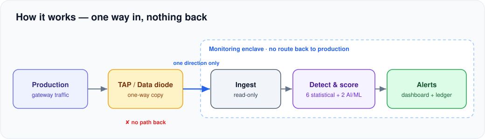
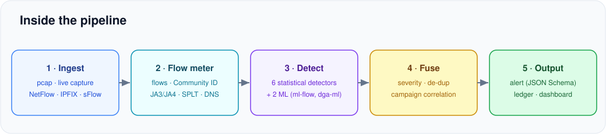

# Enclave Threat Console

**AI/ML detection of cyber threats in one-way (unidirectional) IP traffic.**

Critical-infrastructure links are copied one way into a monitoring enclave through a passive TAP or a
hardware data diode — traffic goes *in*, nothing can come *back*. This project turns that one-way
stream into real-time, scored, **explainable** alerts for six threat classes, using only passively
observed metadata. It never decrypts, never probes, and never blocks.

---

## The problem

A monitoring box behind a diode can *see* everything on the link but has **no path back** into the
production network. That kills an entire class of attacks (a hacked analytics box can't pivot inward),
but the detection logic must work **purely from what it passively observes** — packets, flow records,
and metadata — with no probing, no handshakes, no decryption, and no way to push a block.

## Our solution

A streaming pipeline that ingests the one-way feed and detects, classifies and scores threats in near
real time. Detection is a **hybrid**: fast, always-on statistical detectors form the floor, and **two
supervised ML models** (trained on real CIC-IDS2017 traffic) add a dataset-trained second opinion.
Every alert explains *why* it fired and lands in a tamper-evident, hash-chained ledger.

---

## How it works



1. A switch/router **mirrors** production traffic into a TAP or data diode, which passes the copy
   **one way only** — physically no route back.
2. The enclave **ingests** it read-only, turns packets into flows, and extracts safe metadata
   (JA3/JA4, packet size/timing, DNS names) — no payload is decrypted.
3. Detectors score each flow; **fusion** weights by asset value, de-duplicates, links related stages
   into a campaign, and emits an explainable alert to the dashboard and ledger.

## Inside the pipeline



| Stage | What it does |
| --- | --- |
| **1 · Ingest** | Reads the one-way feed from any source — pcap, live interface, NetFlow, IPFIX/sFlow (goflow2), or an uploaded file. Read-only; a process-level guard blocks any outbound connection. |
| **2 · Flow meter** | Aggregates packets into flows with a direction-agnostic Community ID and extracts TLS JA3/JA4, packet size/timing (SPLT) and DNS names. Payload is never decrypted. |
| **3 · Detect** | 6 statistical detectors + 2 ML models score each flow/event. With flow-only input the DNS/TLS detectors stand down and say why; the rest keep running. |
| **4 · Fuse** | Severity = confidence × class impact × asset criticality; duplicates merge; stages on one host within 15 min correlate into one campaign. |
| **5 · Output** | A standardised JSON alert, streamed to the dashboard and appended to the hash-chained ledger (`SHA-256(prev + record)`). |

Every alert — statistical or ML — carries the same explanation (feature evidence, weighted **top
factors**, and a MITRE ATT&CK mapping), so an analyst always sees *why*. No black box.

---

## What it detects

| Class | Statistical detector | ML |
| --- | --- | --- |
| Volumetric / protocol DDoS | `ddos-stat` — flow-rate z-score, source-IP entropy, SYN-without-handshake, amplification ratio | `ml-flow` |
| Botnet C2 beaconing | `beacon-score` — inter-arrival regularity (CV), repetitions, destination prevalence | `ml-flow` |
| DGA + DNS tunnelling | `dns-lexical` — name entropy, rare-bigram ratio, NXDOMAIN rate, subdomain shape | `dga-ml` |
| Malware in encrypted sessions | `tls-meta` — JA3/JA4 fingerprint, rarity, missing SNI, offline blocklist (no decryption) | — |
| Reconnaissance / scanning | `scan-trw` — Threshold Random Walk on failed first contacts, fan-out shape | `ml-flow` |
| Data exfiltration | `exfil-baseline` — upload vs per-host baseline, out/in ratio, producer-consumer ratio | `ml-flow` |

Plus **campaign correlation** — stages on one host within 15 minutes become one incident.

**Datasets, models & documentation** — trained and validated on real **CIC-IDS2017** flows; a built-in
generator also fabricates labelled lab-style traffic (iperf3, hping3, Slowloris, DGA signatures). Model
cards, feature-engineering rationale and validation metrics:
[MODELS](docs/MODELS.md) · [FEATURES](docs/FEATURES.md) · [VALIDATION](docs/VALIDATION.md).

---

## Results (measured)

- **Throughput** ~12,000 flows/s (detection engine, single process), **p95 latency ~2 ms**
- **`ml-flow`** on real CIC-IDS2017: **0.03% false positives** on real benign, **DDoS F1 0.99**, **C2 F1 0.98**, macro-F1 0.99
- **Quality**: 51 automated tests pass (incl. a read-only egress proof and one isolated capture per threat class) · `ruff` clean · `mypy --strict` clean

## The five architectural constraints

| Constraint | How it is met |
| --- | --- |
| **Read-only ingest** | Listen-only sources; a process-level guard blocks any outbound `connect`/`sendto` (a test proves it) |
| **No payload decryption** | Only the cleartext TLS ClientHello, packet sizes and timing are parsed; QUIC Initial packets stay sealed |
| **Streaming, not batch** | Event-time windows, 5 s active timeout, per-second flush, alerts mid-flow; p50/p95 latency reported |
| **Defined throughput** | ~12,000 flows/s demonstrated (`enclave bench`); shards across cores with `--workers` |
| **Standard alert schema** | Pydantic `Alert` → JSON Schema; Community ID flow id; evidence, factors, MITRE, custody hashes |

## Alert schema & chain of custody

Every alert carries `alert_id`, timestamps, `flow_id` (Community ID v1), the 5-tuple, `threat_class` /
`sub_type`, `confidence`, `severity`, `asset`, `model`, `mitre_attack`, a human `summary` +
`suggested_action`, an `evidence` map, `top_factors`, and a `custody` block. Each is appended to
`var/alerts.jsonl` as `SHA-256(prev_hash + record)`; editing any past line breaks every hash after it,
and `enclave verify-log` recomputes the chain — the **Blockchain & Cybersecurity** theme as a
tamper-evident evidence ledger.

---

## Quick start

Requires Python 3.11+ (developed on 3.12).

```bash
python -m venv .venv
# Windows:  .venv\Scripts\activate      Linux/macOS:  source .venv/bin/activate
pip install -e ".[dev]"

# 1  generate the labelled demo capture + offline intel
enclave synth --out data/demo.pcap --intel intel
#    or one capture per threat class + a benign control, to upload and test each detector alone
enclave synth --per-threat data/threats

# 2  start the dashboard at http://127.0.0.1:8000 (default demo)
#    · "Upload capture"  → analyses your pcap in an isolated report popup
#    · "Run live demo"   → replays the labelled sample into the live feed
enclave serve --config config/enclave.example.json --port 8000

# 3  (optional) same live replay from the command line instead of the button
enclave replay data/demo.pcap --speed 6 --config config/enclave.example.json --serve

# 4  live capture off an interface (the real diode feed), via a streaming pcap
tcpdump -i eth1 -U -w - | enclave sniff --serve       # Windows: dumpcap -i 5 -w - | enclave sniff --serve

# 5  flow-only: NetFlow v5, or v9 / IPFIX / sFlow through goflow2
enclave netflow  --listen 127.0.0.1:2055 --config config/enclave.example.json --serve
goflow2 -format json | enclave flow-json --config config/enclave.example.json --serve

# utilities
enclave bench --flows 200000        # throughput of the detection engine
enclave verify-log var/alerts.jsonl # verify the tamper-evident evidence chain
enclave schema                      # print the standardised alert JSON Schema
```

`--speed 0` means "as fast as possible"; any positive number is a real-time multiplier. Omit `--serve`
to just process the capture and print a summary.
